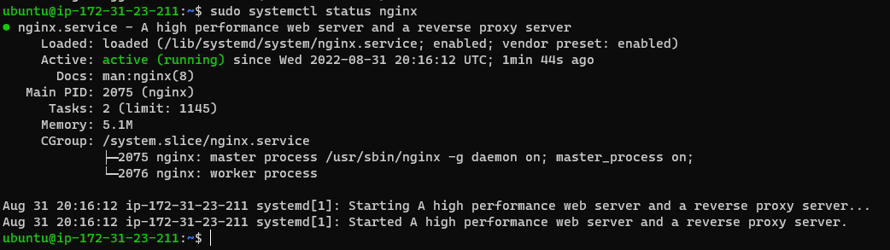
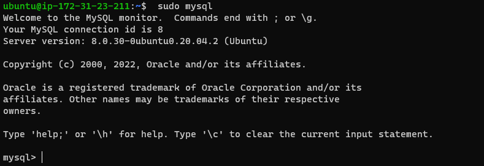
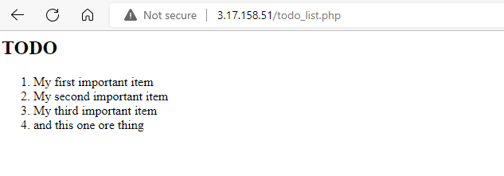

# WEB STACK IMPLEMENTATION (LEMP STACK)

STEP 0: PREPARING PREREQUISITES
> create a new instance for project 2 and ssh into the instance

STEP 1:  INSTALLING NGINX

 > Update Ubuntu server package

 `sudo apt update`

 

 > get Nginx installed

 `sudo apt install nginx`

 > To verify that nginx was successfully installed and is running as a service in Ubuntu, run:

 `sudo systemctl status nginx`

 

 > To check if the server can be accessed locally, run:

 `curl http://localhost:80`

 > or

 `curl http://127.0.0.1:80`

 > Open a web browser of your choice and try to access following url

 `http://<Public-IP-Address>:80`

 > To retrieve your Public IP address

 `curl -s http://169.254.169.254/latest/meta-data/public-ipv4`

 

STEP 2:  INSTALLING MYSQL

 > Install MySQL server

 `sudo apt install mysql-server`

 >Type y and press enter when prompted
 >
 >When the installation is finished, log in to the MySQL console by typing:

 `sudo mysql`

 

 >Exit Mysql

 Mysql> `Exit`

STEP 3 – INSTALLING PHP

To install these 2 packages at once, run:

`sudo apt install php-fpm php-mysql`

When prompted, type 'Y' and press ENTER to confirm installation

PHP components are now installed.

STEP 4:  CONFIGURING NGINX TO USE PHP PROCESSOR

Create the root web directory for your_domain as follows:

`sudo mkdir /var/www/projectLEMP`

Assign ownership of the directory with the $USER environment variable

`sudo chown -R $USER:$USER /var/www/projectLEMP`

open a new configuration file in Nginx’s 'sites-available' directory using 'nano'

`sudo nano /etc/nginx/sites-available/projectLEMP`

copy and paste the configuration script

Activate the configuration by linking to the config file from Nginx’s 'sites-enabled' directory:

`sudo ln -s /etc/nginx/sites-available/projectLEMP /etc/nginx/sites-enabled/`

This will tell Nginx to use the configuration next time it is reloaded

Test the configuration for syntax errors

`sudo nginx -t`

Disable default Nginx host that is currently configured to listen on port 80:

`sudo unlink /etc/nginx/sites-enabled/default`

Reload Nginx to apply the changes:

`sudo systemctl reload nginx`

Create an index.html file in web root /var/www/projectLEMP location so that we can test that the new server block works as expected:

`sudo echo 'Hello LEMP from hostname' $(curl -s http://169.254.169.254/latest/meta-data/public-hostname) 'with public IP' $(curl -s http://169.254.169.254/latest/meta-data/public-ipv4) > /var/www/projectLEMP/index.html`

`http://3.145.29.248:80`

STEP 5:  TESTING PHP WITH NGINX

At this point, LAMP stack is completely installed and fully operational. To validate that Nginx can correctly hand .php files off to your PHP processor, creating a test PHP file in your document root:

`sudo nano /var/www/projectLEMP/info.php`

Insert the PHP script

To access this page in the web browser type and enter the url below:

"http://3.145.29.248/info.php"

A web page containing detailed information about your server is displayed:

To remove that file:

`sudo rm /var/www/your_domain/info.php`

STEP 6: RETRIEVING DATA FROM MYSQL DATABASE WITH PHP

First, connect to the MySQL console using the root account:

`sudo mysql`

To create a new database, run the following command from your MySQL console:

CREATE DATABASE `example_database`;

Create a new user and grant full privileges on the database that's just been created.

`CREATE USER 'example_user'@'%' IDENTIFIED WITH mysql_native_password BY 'password';`

Give this user permission over the example_database database:

`GRANT ALL ON example_database.* TO 'example_user'@'%';`

Exit the MySQL shell with:

`exit`

 Test if the new user has the proper permissions by logging in to the MySQL console again, this time using the custom user credentials:

 `mysql -u example_user -p`

 Then confirm that you have access to the example_database database:

 `SHOW DATABASES;`

 This will give you the following output:

 

 Create a test table named todo_list

`CREATE TABLE example_database.todo_list (
item_id INT AUTO_INCREMENT,
content VARCHAR(255),
PRIMARY KEY(item_id)
);`

Insert a few rows of content in the test table.Repeat the next command a few times, using different VALUES:

`INSERT INTO example_database.todo_list (content) VALUES ("My first important item");`

To confirm that the data was successfully saved to your table, run:

`SELECT * FROM example_database.todo_list;`

You’ll see the following output:

Exit the MySQL console after confirmation

`exit`

Now that a created PHP script will connect to MySQL and query for content. Create a new PHP file in your custom web root directory:

`nano /var/www/projectLEMP/todo_list.php`

Copy this content into your todo_list.php script:

Save and close the file when you are done editing

Access this page in your web browser by visiting the domain name or public IP address configured for your website, followed by /todo_list.php:

"http://3.145.29.248/todo_list.php"

That means your PHP environment is ready to connect and interact with your MySQL server.
